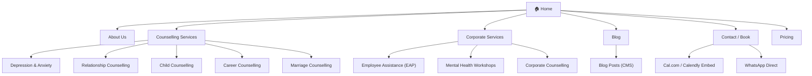

# Healing60 Website Redesign — "The Inner Space"

A complete ground-up redesign of [healing60.com](https://healing60.com/) from a GoDaddy template into a premium, immersive, scroll-driven experience inspired by [Augen](https://augen.pro) and [Superpower](https://superpower.com). The new site must feel **calming, premium, and trustworthy** — not like a template.

---

## Current State Audit

````carousel

<!-- slide -->

<!-- slide -->

<!-- slide -->

<!-- slide -->

````

**Problems identified:**
- Generic GoDaddy/Squarespace template aesthetic — zero brand personality
- Standard block-based layout with no visual rhythm or intentional whitespace
- No scroll-driven storytelling; page feels like a list of sections
- Typography is default sans-serif with no hierarchy or character
- Color palette (pink/white) is flat and doesn't convey calm/trust
- No micro-interactions, no depth, no sense of "arriving" at a safe space
- WhatsApp widget is a generic popup, not integrated into the design
- Zero SEO structure — title says generic "Psychologist in Indore"

---

## Inspiration DNA Extraction

````carousel

<!-- slide -->

<!-- slide -->

<!-- slide -->

````

| Pattern | Augen | Superpower | → Healing60 Application |
|---|---|---|---|
| **Layout** | Intentional asymmetry, offset content | Asymmetric bespoke grids | Offset text + floating 3D objects, never centered-everything |
| **Whitespace** | Extreme padding, no clutter | Generous spacing between sections | "Breathable" sections ~100vh tall, content only occupies 40-60% |
| **Typography** | Tight lettering, indexed labels `01`, superscripts | Bold sans-serif, massive headlines | Use `01 Services` indexing for authority; large, light headlines |
| **Color shifts** | Full-width bg transitions (white→black→blue) | Dark hero ↔ white sections oscillation | Soft transitions: warm cream → sage → lavender → charcoal |
| **CTAs** | Circular arrow icons, pill shapes | High-energy orange buttons, sparing use | Warm sage/lavender pill CTAs with subtle hover glow |
| **Social proof** | Scientific authority (`ICT²`) | Video testimonials, doctor grid, university logos | Therapist grid with glassmorphism + trust badges |
| **Scroll** | GSAP scroll-linked animations | Long cinematic scroll, section pinning | GSAP ScrollTrigger for 3D scene progression + text reveals |

---

## Decisions Made

| Question | Decision | Rationale |
|---|---|---|
| **3D approach** | Hybrid — R3F for hero only, GSAP + CSS 3D everywhere else | Keeps the "wow" factor while minimizing WebGL complexity |
| **CMS** | Local JSON data files initially, Sanity-ready architecture | Gets site live faster; migrate to Sanity when clinic needs self-serve |
| **Booking** | WhatsApp (primary) + Cal.com embed (secondary on contact page) | WhatsApp is familiar to clinic; Cal.com adds professional option |
| **3D assets** | Procedural R3F geometries (no external Spline dependency) | Self-contained, no design bottleneck |

---

## Resilience & Fallback Strategy

> [!IMPORTANT]
> **Every 3D/WebGL element MUST have a CSS-only fallback that is independently beautiful.** If R3F is disabled entirely, the site must still look premium. The fallback is not a degraded experience — it is an alternative design path.

### Fallback Matrix

| Element | Primary (R3F / WebGL) | Fallback (CSS-only) | Trigger |
|---|---|---|---|
| **Hero scene** | Morphing organic blob with mouse reactivity | Multi-layered CSS radial gradients with `@keyframes` pulse animation + subtle `backdrop-filter` blur orbs | WebGL context failure, `<canvas>` unsupported, or `prefers-reduced-motion` |
| **Particle field** (Philosophy bg) | R3F Points (200-500 particles) | CSS `box-shadow` scattered dots with slow `translateY` drift animation | Same as above |
| **Service card icons** | Spline-designed 3D shapes | SVG icons with CSS `perspective` + `rotateY` hover transform | Always SVG; 3D icons are a progressive enhancement |
| **Card tilt-on-hover** | R3F or heavy JS pointer tracking | Pure CSS `perspective` + `:hover` `rotateX/rotateY` transform | Default is CSS; JS tilt is enhancement |
| **Scroll-linked 3D progression** | R3F scene reacts to GSAP ScrollTrigger | GSAP animates CSS transforms (`scale`, `rotate3d`, `opacity`) on DOM elements | No R3F needed; GSAP handles this natively |

### Implementation Rule

```
1. Build the CSS fallback FIRST — it must look finished and premium on its own
2. Layer R3F on top as progressive enhancement
3. Detect WebGL support at runtime: if unsupported, CSS fallback renders automatically
4. Respect `prefers-reduced-motion`: disable ALL animation (3D and CSS), show static layout
```

### Maintainability Guarantee

If R3F is removed from `package.json` tomorrow:
- **Zero visual breakage** — CSS fallbacks activate automatically
- **No layout shifts** — fallback elements occupy the same space as 3D counterparts
- **Same emotional tone** — soft gradients, glowing orbs, and gentle motion preserved in CSS

---

## Design System

### Color Palette

| Token | Hex | Usage |
|---|---|---|
| `--cream` | `#FAF7F2` | Primary background, "safe space" base |
| `--lavender` | `#C4B5E0` | Accent, trust, calm — CTAs & highlights |
| `--lavender-deep` | `#8B7BB8` | Hover states, active elements |
| `--sage` | `#A8C5A0` | Growth, healing — secondary accent |
| `--sage-deep` | `#6B9B63` | Hover states |
| `--charcoal` | `#2D2D2D` | Body text — never pure black |
| `--charcoal-light` | `#5A5A5A` | Secondary text, captions |
| `--warm-white` | `#FFFFFF` | Cards, elevated surfaces |
| `--glass` | `rgba(255,255,255,0.12)` | Glassmorphism panels |
| `--glow-lavender` | `rgba(196,181,224,0.3)` | Ambient glow effects |

### Typography

| Element | Font | Weight | Size (desktop) | Tracking |
|---|---|---|---|---|
| Display headline | **Outfit** | 300 (Light) | `clamp(3rem, 6vw, 5.5rem)` | `-0.03em` |
| Section index | **Outfit** | 400 | `0.75rem` | `0.15em` (wide) |
| Body | **Inter** | 400 | `1.125rem` | `0em` |
| Caption / Label | **Inter** | 500 | `0.8125rem` | `0.08em` |
| CTA Button | **Inter** | 600 | `0.9375rem` | `0.04em` |

### Spacing System (8px base)

`4px · 8px · 16px · 24px · 32px · 48px · 64px · 96px · 128px · 192px`

Section vertical padding: `128px` desktop, `80px` mobile.

---

## Mobile Parity Mandate

> [!CAUTION]
> **The mobile experience is NOT a degraded version of desktop. It must look equally premium, equally atmospheric, and equally "wow."** Over 70% of Indian web traffic is mobile — for a clinic in Indore, mobile IS the primary experience.

### Core Rules

| Rule | Desktop | Mobile | Parity Strategy |
|---|---|---|---|
| **Hero scene** | R3F blob + mouse parallax | CSS gradient orbs + gyroscope tilt (via `DeviceOrientationEvent`) | Both feel atmospheric and alive; mobile uses lighter GPU path |
| **Typography scale** | `clamp()` fluid scaling | Same `clamp()` — no breakpoint jumps | Seamless scaling, never feels "shrunk" |
| **Whitespace** | 128px section padding | 80px section padding | Still generous, never cramped |
| **Navigation** | Pill links + CTA in top bar | Full-screen overlay with staggered animation | Mobile nav is a *moment*, not a dropdown |
| **Cards / Grids** | Asymmetric multi-column | Single-column stack with preserved tilt-on-tap | Cards become full-width but keep glassmorphism & depth |
| **Testimonials** | Horizontal scroll carousel | Swipeable touch carousel (same visual depth layering) | Front/back blur depth preserved |
| **3D fallback** | R3F if WebGL available | CSS fallback (always) — mobile defaults to CSS path | Mobile gets the beautiful fallback by default for battery/perf |
| **Glassmorphism** | `backdrop-filter: blur(12px)` | Same — renders beautifully on OLED | No degradation |
| **Scroll animations** | GSAP ScrollTrigger (full) | GSAP ScrollTrigger (same, but `scrub` values adjusted for touch inertia) | Identical animation triggers, tuned for touch scroll physics |
| **WhatsApp CTA** | Pill button in hero + footer | Floating branded fab (bottom-right) + hero pill | One-tap access on the device where WhatsApp actually lives |

### Breakpoints

| Token | Width | Target |
|---|---|---|
| `sm` | `640px` | Large phones (landscape) |
| `md` | `768px` | Tablets |
| `lg` | `1024px` | Small laptops |
| `xl` | `1280px` | Desktop |
| `2xl` | `1536px` | Large monitors |

### Testing Devices

- **iPhone SE (375px)** — smallest common viewport, must look intentional, not broken
- **iPhone 14 Pro (393px)** — OLED reference for glassmorphism/gradients
- **Samsung Galaxy A14 (412px)** — mid-range Android, the actual target device for Indore users
- **iPad Mini (768px)** — tablet breakpoint
- **Desktop 1440px** — standard reference

---

## Proposed Site Architecture



**Consolidated from 12+ nav items → 6 primary routes.** Services are grouped logically instead of flat-listed.

---

## Proposed Changes

### Phase 1 — Project Foundation

#### [NEW] Project initialization

```
npx -y create-next-app@14 ./ \
  --typescript --tailwind --eslint --app \
  --src-dir --import-alias "@/*" --no-turbopack
```

#### [NEW] Design system setup

| File | Purpose |
|---|---|
| `tailwind.config.ts` | Custom theme tokens (palette, fonts, spacing, blur values) |
| `src/app/globals.css` | CSS custom properties, base resets, font imports (Outfit + Inter) |
| `src/lib/fonts.ts` | Google Fonts `next/font` config for Outfit + Inter |
| `src/lib/animations.ts` | GSAP ScrollTrigger registration + shared animation presets |

---

### Phase 2 — Core Layout Shell

#### [NEW] `src/components/layout/Navbar.tsx`
Minimal translucent navbar inspired by Augen:
- Logo (left), 4 pill-shaped nav links (center), CTA button (right)
- Glassmorphism blur backdrop on scroll (`backdrop-filter: blur(12px)`)
- Mobile: hamburger → full-screen overlay with staggered fade-in links
- Sticky with hide-on-scroll-down, reveal-on-scroll-up (GSAP)

#### [NEW] `src/components/layout/Footer.tsx`
Full-width atmospheric footer:
- Warm gradient background (lavender → sage → cream)
- 3-column grid: Navigation, Contact (phone, email, WhatsApp), Social
- "Healing 60" wordmark large and faded as background texture
- Copyright, Privacy Policy, Terms links

#### [NEW] `src/components/layout/PageTransition.tsx`
Framer Motion `AnimatePresence` wrapper for route transitions — soft fade + slight upward slide.

---

### Phase 3 — Homepage Sections (scroll-driven narrative)

The homepage is designed as a **7-section vertical narrative** — each section ~100vh — that tells the story: *"From the chaos of your world → into a calm inner space → meet us → trust us → book."*

#### Section 1: Hero — "A space where healing begins."

- **Visual:** Full-viewport. Soft 3D ambient scene (Spline or R3F — organic blob morphing slowly in lavender/sage tones). Scene reacts to mouse (desktop) / gyroscope (mobile).
- **Copy:** Large display headline: `A space where healing begins.` Subtext: `Psychology & Counselling in Indore`
- **CTA:** Pill button `Book a Session` + subtle downward scroll indicator (animated chevron)
- **Technical:** `<Canvas>` from R3F with `<Suspense>` + `<Preload all>`. Fallback = CSS gradient animation.

#### Section 2: Philosophy — "What brings you here?"

- **Visual:** Text-dominant. Words fade in at different Z-depths (parallax) via GSAP ScrollTrigger. Soft particle field drifts in background (R3F points).
- **Content:** Empathetic copy addressing visitor's state. Interactive concern chips (Anxiety, Depression, Relationships, etc.) — clicking one leads to the relevant service page.
- **Augen-inspired:** Indexed label `01 — Understanding You` in small caps above the headline.

#### Section 3: Services — Core Counselling

- **Visual:** Asymmetric card grid (not a boring 3-column). Cards have CSS `perspective` tilt-on-hover. Each card has a minimal 3D icon (Spline-designed or SVG with CSS 3D transform).
- **Content:** 5 service cards: Depression & Anxiety, Relationship, Child, Career, Marriage Counselling.
- **Superpower-inspired:** Large section number `02` in faded background. Cards are different sizes (1 large featured, 4 standard).

#### Section 4: Meet the Therapists

- **Visual:** Glassmorphism portrait cards (frosted glass panels that shift on hover). Clean photography with warm color grading.
- **Content:** Therapist name, title, specialization, brief quote.
- **Superpower-inspired:** Similar to Superpower's medical professionals grid. Trust badges below (certifications, years of experience).

#### Section 5: Trust & Testimonials

- **Visual:** Horizontal scroll carousel with depth layering — front card sharp, background cards blurred + scaled down. Subtle parallax.
- **Content:** Google reviews pulled as text quotes (star rating, name, snippet).
- **Statistics bar:** `500+ Lives Touched` · `4.9★ Rating` · `8+ Years Experience` — animated counter on scroll-enter.

#### Section 6: Corporate Services

- **Visual:** Background shifts to charcoal (Augen-style color block). White text. Creates visual break and signals "professional/B2B."
- **Content:** EAP, Mental Health Workshops, Corporate Counselling — 3 horizontal cards.
- **CTA:** `Partner with us` button.

#### Section 7: Booking CTA — "You've arrived."

- **Visual:** Full-screen warm auroral gradient (animated CSS `@keyframes`). Optional: minimal 3D ambient scene (simplified). Feels like "arriving" at a destination.
- **Copy:** `Ready to begin?` with booking embed (Cal.com styled to match) or WhatsApp direct link.
- **WhatsApp integration:** Styled branded button, not a generic widget.

---

### Phase 4 — Inner Pages

#### [NEW] `src/app/about/page.tsx`
- Full-bleed therapist story section with scroll-triggered text reveals
- Timeline of the clinic's journey (Augen-style indexed: `2018 · Founded`, `2022 · 500+ clients`)
- Team deep-dive with expanded bios

#### [NEW] `src/app/services/[slug]/page.tsx`
- Dynamic route for each service (data from Sanity or local JSON initially)
- Hero with service-specific 3D icon or atmospheric photo
- Symptoms/signs section, approach, what to expect, FAQ accordion
- Persistent sidebar CTA: `Book this service`

#### [NEW] `src/app/pricing/page.tsx`
- Superpower-inspired value contrast table
- Session types, durations, pricing
- Transparent, no-surprise layout

#### [NEW] `src/app/blog/page.tsx` + `src/app/blog/[slug]/page.tsx`
- Card grid for posts (Sanity CMS or MDX initially)
- Clean reading experience with proper typographic rhythm

#### [NEW] `src/app/contact/page.tsx`
- Split layout: Contact form (left) + Map embed + clinic hours (right)
- WhatsApp, phone, email with branded icons
- Cal.com booking embed

---

### Phase 5 — 3D & Animation Layer

> See **Resilience & Fallback Strategy** above — every element below has a CSS-only counterpart that ships first.

#### [NEW] `src/components/3d/HeroScene.tsx`
- R3F Canvas with organic morphing geometry (sphere → blob via vertex displacement shader)
- Mouse/gyroscope reactivity via `useFrame` + pointer events
- **Mobile:** defaults to CSS fallback path (gradient orbs) — R3F only loads on desktop with confirmed WebGL support
- Wrapped in `<Suspense>` with the CSS fallback as the loading state (so fallback is *always* visible first)

#### [NEW] `src/components/3d/HeroFallback.tsx`
- **Built first, tested independently** — must be indistinguishable from "a finished design"
- Multi-layer CSS radial gradients (lavender, sage, cream) with slow `@keyframes` pulse
- 3-4 blurred orbs using `box-shadow` + `filter: blur()` with staggered `animation-delay`
- Subtle `translateY` float on orbs for gentle organic motion
- Occupies identical viewport space as the R3F canvas

#### [NEW] `src/components/3d/ParticleField.tsx`
- R3F Points component — 200-500 softly drifting particles (desktop only)
- **Fallback:** CSS scattered dots with `translateY` drift (see fallback matrix)
- Fades in/out based on scroll position (GSAP ScrollTrigger)

#### [NEW] `src/lib/useWebGLSupport.ts`
- Hook that detects WebGL availability + GPU tier (via `detect-gpu` package)
- Returns `'full' | 'reduced' | 'none'` — components use this to choose render path
- Also checks `prefers-reduced-motion` — returns `'none'` if user prefers reduced motion

#### [NEW] `src/lib/animations.ts`
- GSAP ScrollTrigger preset factory functions:
  - `fadeInUp(element, trigger)` — standard entrance
  - `parallaxDepth(elements, speeds)` — multi-speed parallax
  - `horizontalScroll(container)` — testimonials carousel
  - `counterUp(element, target)` — stats animation
  - `colorBlockTransition(section, fromBg, toBg)` — Augen-style bg shifts
- All presets accept `{ mobile: boolean }` flag to adjust `scrub` and `duration` for touch scroll physics

---

### Phase 6 — CMS Integration (Sanity.io)

#### [NEW] `sanity/` directory
- Schemas: `therapist`, `service`, `testimonial`, `blogPost`, `siteSettings`
- Sanity Studio deployed to `studio.healing60.com`

#### [NEW] `src/lib/sanity.ts`
- Sanity client config + GROQ query helpers
- `getTherapists()`, `getServices()`, `getPosts()`, `getTestimonials()`

> **Initial approach:** Start with local JSON data files, migrate to Sanity after core site is built and approved.

---

### Phase 7 — SEO & Performance

#### SEO
- `metadata` exports on every page (Next.js App Router)
- JSON-LD structured data: `LocalBusiness`, `MedicalBusiness`, `Person` (therapists)
- Sitemap via `next-sitemap`
- `robots.txt` allowing all crawlers
- OpenGraph images auto-generated or custom per page

#### Performance
- 3D assets lazy-loaded with `<Suspense>` + skeleton loaders
- Images via `next/image` with WebP/AVIF auto-format
- Font subsetting (Latin only for Outfit + Inter)
- Target: Lighthouse ≥ 90 on all categories (Performance, Accessibility, Best Practices, SEO)

---

### Phase 8 — Deployment

- **Hosting:** Vercel (automatic CI/CD from Git)
- **Domain:** Transfer `healing60.com` DNS to Vercel (or point A/CNAME records)
- **Analytics:** Vercel Analytics + Google Analytics 4
- **Monitoring:** Vercel Speed Insights for Core Web Vitals

---

## Verification Plan

### Automated Tests
1. **Lighthouse audit** on built site: `npx lighthouse http://localhost:3000 --output=json` — target ≥ 90 all categories
2. **Build verification:** `npm run build` must pass zero errors
3. **Accessibility:** `npx @axe-core/cli http://localhost:3000` — zero critical/serious violations
4. **Mobile responsiveness:** Browser-based screenshot testing at 375px, 393px, 412px, 768px, 1440px viewports

### Fallback Verification
1. **Disable WebGL:** Set `useWebGLSupport` to force `'none'` — verify entire site renders beautifully with CSS-only path
2. **Reduced motion:** Enable `prefers-reduced-motion: reduce` in OS settings — verify all animations are disabled, layout intact
3. **Side-by-side comparison:** Screenshot hero at 1440px with R3F ON vs OFF — both must feel premium (not "broken" vs "working")

### Mobile Parity Checks
1. **375px (iPhone SE):** No text overflow, no horizontal scroll, glassmorphism renders, CTA visible above fold
2. **412px (Galaxy A14):** Scroll animations fire correctly on touch, WhatsApp fab visible, hero fallback looks atmospheric
3. **768px (iPad):** Grid layouts transition cleanly, no awkward single-column-on-wide-screen
4. **Touch interactions:** Tilt-on-tap triggers on service cards, testimonial carousel is swipeable, no hover-only states

### Manual Verification (by user)
1. **Scroll on desktop:** Does the scroll narrative feel smooth and cinematic? Does it feel like "traveling inward"?
2. **Scroll on mobile:** Does mobile feel *as premium as desktop* — not a diluted version?
3. **Fallback test:** With 3D disabled, does the hero still feel atmospheric and intentional?
4. **Booking flow:** Can a user reach WhatsApp within 1 tap on mobile, 2 clicks on desktop?
5. **Content accuracy:** Are therapist names, service descriptions, and pricing correct?
6. **Brand alignment:** Does the overall feel match "calming, premium, trustworthy" — not clinical or cold?

---

## Implementation Timeline Estimate

| Phase | Effort | Dependencies |
|---|---|---|
| 1. Foundation | 1 session | None |
| 2. Layout shell | 1 session | Phase 1 |
| 3. Homepage sections | 3-4 sessions | Phase 2, 3D assets |
| 4. Inner pages | 2-3 sessions | Phase 2 |
| 5. 3D & Animations | 2-3 sessions | Spline assets or R3F custom |
| 6. CMS | 1-2 sessions | Phase 3-4 content structure |
| 7. SEO & Perf | 1 session | Phase 3-4 |
| 8. Deployment | 1 session | All phases |

**Total: ~12-16 working sessions**
